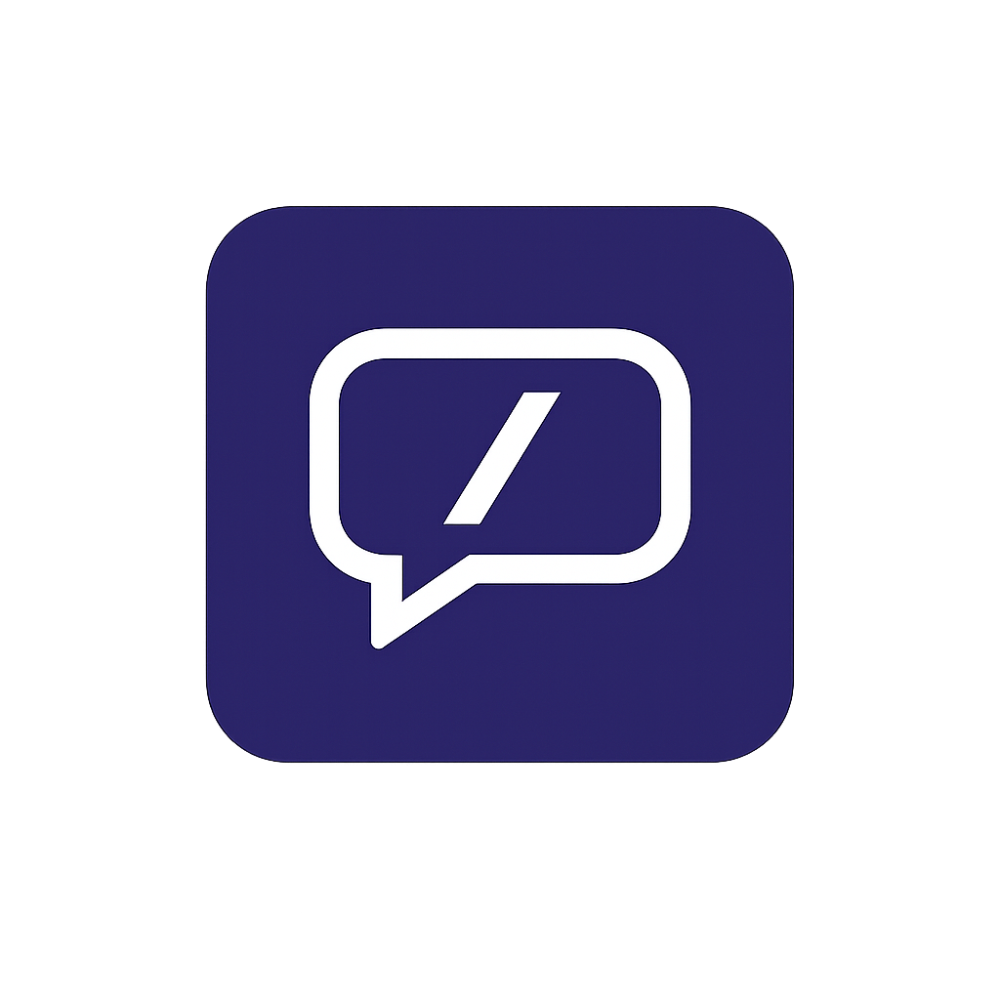

# Expressly

<p align="center">
  
</p>

<p align="center">
  <b>Expressly</b> — a privacy-conscious, customizable keyboard with a built-in GIF search system
</p>

Forked from [HeliBoard](https://github.com/Helium314/HeliBoard) and extended with original features.

## What's New in Expressly

### 🎬 Built-in GIF System (built from scratch)
Expressly ships a fully custom GIF picker built on top of the [Klipy API](https://klipy.com):

- **Search GIFs** directly from the keyboard — type a query and press the search key
- **Animated previews** in a staggered 2-column grid powered by Glide
- **Usage-based suggestions** — the keyboard learns which GIFs you search most and shows them as quick-tap chips when you open the picker
- **Scroll without accidental sends** — touch slop detection prevents taps from firing during scrolls
- **Keyboard hides after results load** so you can browse freely; reappears when you start typing again
- **Sends GIFs via `commitContent`** — works with Signal, Telegram, and any app that supports rich content insertion
- **Settings gear** in the GIF panel opens the Klipy API key configuration screen

### 🔧 Other Improvements
- Fixed suggestion strip / toolbar click-through on all keyboard modes (emoji, clipboard, GIF)
- Improved `onComputeInsets` to use `getLocationInWindow` for accurate touchable region in all modes

---

## Features (inherited from HeliBoard)

- Add dictionaries for suggestions and spell check
- Customize keyboard themes (style, colors, background image)
  - Follows system day/night setting on Android 10+
  - Follows dynamic colors on Android 12+
- Customize keyboard [layouts](layouts.md)
- Multilingual typing
- Glide typing *(closed-source library required)*
- Clipboard history
- One-handed mode
- Split keyboard
- Number pad
- Backup and restore settings and learned word data

---

## Setting Up GIF Search

1. Get a free API key from [klipy.com/api-overview](https://klipy.com/api-overview)
2. Open Expressly settings → **GIF (Klipy)**
3. Enable GIF search and paste your API key
4. Tap the emoji key on the keyboard, then the GIF tab

Alternatively, add `KLIPY_API_KEY=your_key` to `local.properties` before building to bake the key into the APK.

---

## Building

```bash
# Debug build
./gradlew assembleDebug

# Release build
./gradlew assembleRelease
```

Add your signing config to `local.properties` or `build.gradle.kts` for signed release builds.

---

## License

Expressly is a fork of HeliBoard (fork of OpenBoard), licensed under **GNU General Public License v3.0**.

The GIF system (GifSearchView, GifPrefs, GifConfig, TenorSettingsActivity) is original code written for Expressly.

See [LICENSE](/LICENSE) for the full license text.
Since the app is based on Apache 2.0 licensed AOSP Keyboard, an [Apache 2.0](LICENSE-Apache-2.0) license file is also provided.

---

## Credits

- **GIF system** — built from scratch for Expressly
- [HeliBoard](https://github.com/Helium314/HeliBoard) — upstream fork base
- [OpenBoard](https://github.com/openboard-team/openboard)
- [AOSP Keyboard](https://android.googlesource.com/platform/packages/inputmethods/LatinIME/)
- [LineageOS](https://review.lineageos.org/admin/repos/LineageOS/android_packages_inputmethods_LatinIME)
- [Simple Keyboard](https://github.com/rkkr/simple-keyboard)
- [FlorisBoard](https://github.com/florisboard/florisboard/)
